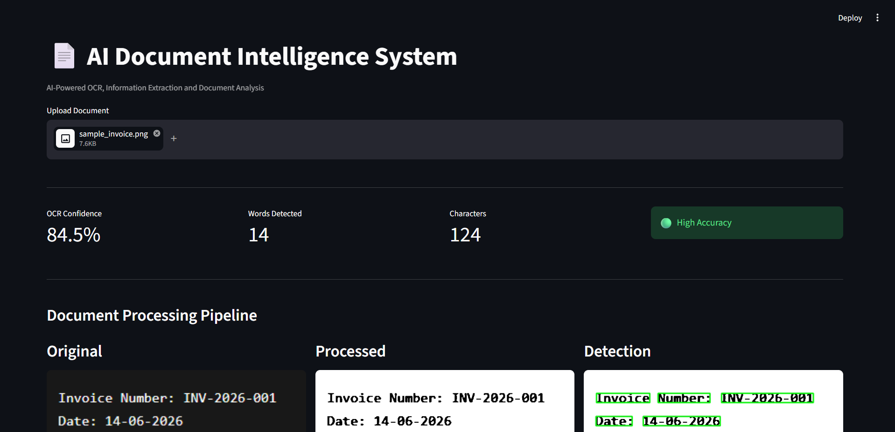
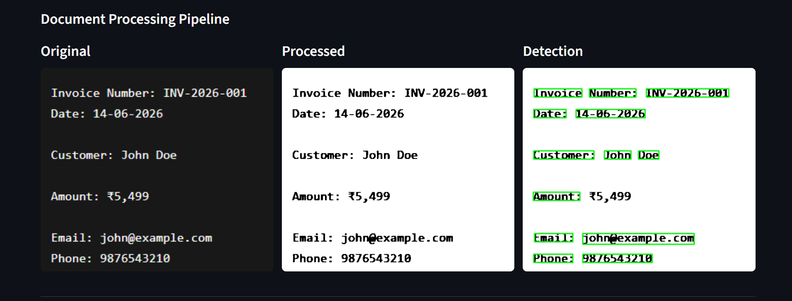
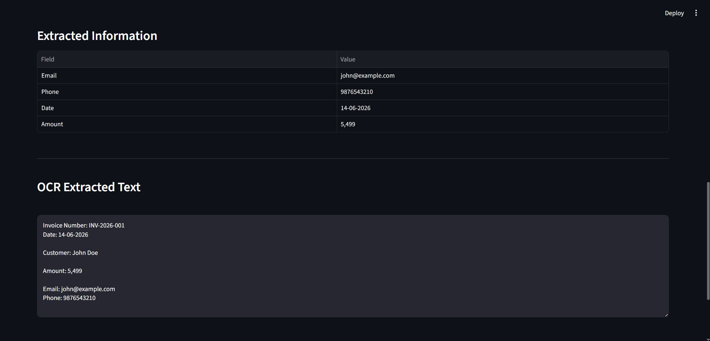
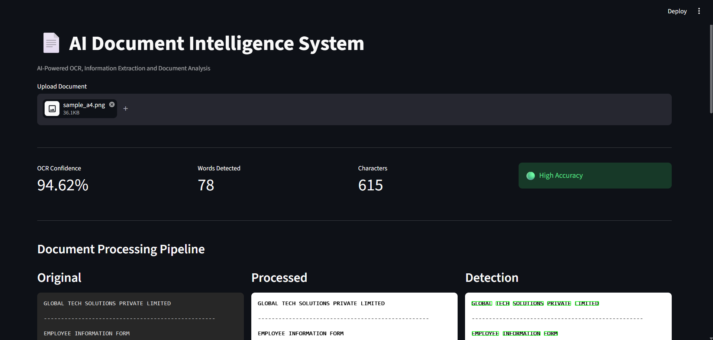
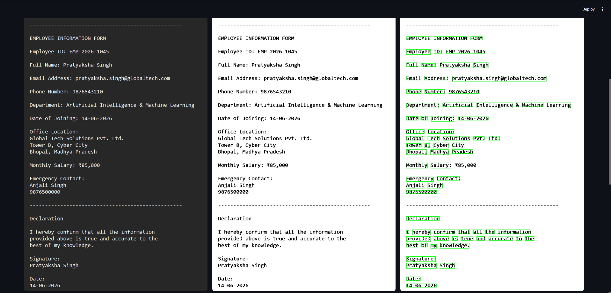
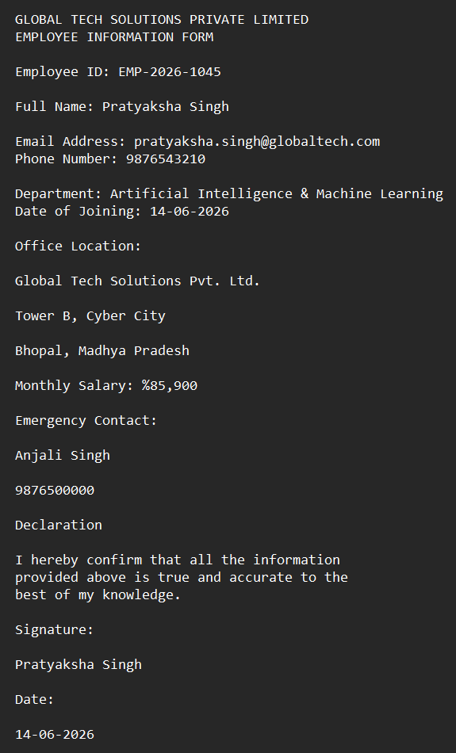

# AI Document Intelligence System

## Overview

AI Document Intelligence System is an OCR-powered document analysis application that extracts text and structured information from images and scanned documents. The system combines image preprocessing, Optical Character Recognition (OCR), confidence analysis, and information extraction to provide an end-to-end document processing solution.

Built using Python, OpenCV, Tesseract OCR, and Streamlit, the application offers an interactive interface for analyzing documents and extracting valuable information automatically.

## Features

- OCR-based text extraction using Tesseract
- Image preprocessing for improved recognition accuracy
- OCR confidence score analysis
- Automatic extraction of structured information
- Bounding box visualization for detected text regions
- Side-by-side document processing pipeline visualization
- Download OCR output as TXT
- Download extracted information as CSV
- Interactive Streamlit dashboard
- Support for PNG, JPG, and JPEG image formats

## Tech Stack

- Python
- Streamlit
- OpenCV
- Tesseract OCR
- NumPy
- Pandas
- Pillow
- Regular Expressions (Regex)

## Project Structure

```text
AI-Document-Intelligence-System
│
├── assets
│   ├── sample_invoice.png
│   └── sample_a4.png
│
├── modules
│   ├── confidence_analyzer.py
│   ├── image_processor.py
│   ├── information_extractor.py
│   ├── ocr_engine.py
│   └── text_cleaner.py
│
├── outputs
│   ├── dashboard.png
│   ├── dashboard_a4.png
│   ├── extracted.png
│   ├── extracted_a4.png
│   ├── pipeline.png
│   └── pipeline_a4.png
│
├── app.py
├── test_ocr.py
├── requirements.txt
└── README.md
```

## Workflow

```text
Input Document
      ↓
Image Preprocessing
      ↓
OCR Text Extraction
      ↓
Confidence Analysis
      ↓
Information Extraction
      ↓
Bounding Box Detection
      ↓
Results Visualization
      ↓
Export Results
```

## Image Preprocessing

The application performs the following preprocessing operations before OCR:

- Grayscale Conversion
- Image Upscaling
- Gaussian Blur
- Otsu Thresholding
- Binary Inversion

These steps significantly improve OCR accuracy and confidence scores.

## Information Extraction

The system automatically extracts:

- Email Address
- Phone Number
- Date
- Amount

The complete OCR output is also preserved and displayed to the user.

## OCR Confidence Analysis

The application calculates the average confidence score returned by Tesseract OCR.

| Confidence Score | Status |
|------------------|---------|
| 80% and above | High Accuracy |
| 60% – 79% | Medium Accuracy |
| Below 60% | Low Accuracy |

## Dashboard Features

The Streamlit dashboard provides:

- Original Document View
- Processed Document View
- OCR Detection View
- OCR Confidence Metrics
- Detection Status
- Extracted Information Table
- Complete OCR Output
- TXT Export
- CSV Export

## Sample Results

### Dashboard View



### OCR Processing Pipeline



### Extracted Information



### A4 Document Dashboard



### A4 OCR Pipeline



### A4 Extracted Information



## Installation

### Clone the Repository

```bash
git clone https://github.com/your-username/AI-Document-Intelligence-System.git
cd AI-Document-Intelligence-System
```

### Create Virtual Environment

```bash
python -m venv venv
```

### Activate Virtual Environment

#### Windows

```bash
venv\Scripts\activate
```

### Install Dependencies

```bash
pip install -r requirements.txt
```

## Tesseract OCR Setup

Download and install Tesseract OCR.

Default installation location:

```text
C:\Program Files\Tesseract-OCR
```

Verify installation:

```bash
tesseract --version
```

## Running the Application

Start the Streamlit application:

```bash
streamlit run app.py
```

The application will open at:

```text
http://localhost:8501
```

## Testing the OCR Pipeline

To run the standalone OCR test:

```bash
python test_ocr.py
```

## Performance

The system was successfully tested on:

- Invoice Documents
- Structured A4 Forms
- Text-Based Images

OCR confidence scores above 80% were achieved on the provided sample documents after preprocessing.

## Future Improvements

- PDF Document Support
- Multi-Page OCR Processing
- Named Entity Recognition (NER)
- Automatic Document Classification
- Database Integration
- Cloud Deployment
- Advanced OCR Error Correction

---

## Author

**Pratyaksha Singh**  
B.Tech Computer Science and Engineering  
VIT Bhopal University

## License

This project is intended for educational and learning purposes.